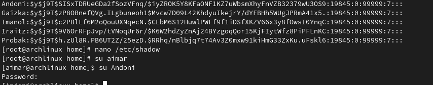

# Ariketak


## 2 Ariketa

```bash
# Erabiltzailea jartzeko
echo "useradd -m Izena"
```

## Pasahitza jartzeko

```bash
echo "passwd Izena"
```


## 3 Ariketa


Non gordetzen da informazio guzti hau? Zer egin genezake fitxategi horretan?



## 4 Ariketa

```bash
# Ezabatu Probak erabiltzea eta berari dagokion /home direktorioa ere bai agindu bakar batez.
rmdir Probak
```


## 5 Ariketa

### Taldeak egingo ditugu.
- Taldeak Primarioak:
-ikasleak (Iraitz / Gaizka)
-irakasleak ( Imanol / Andoni)

```bash
usermod -g irakasleak izena
usermod -aG izena izena
groups izena
usermod -g ikasleak izena
usermod -aG izena izena
groups izena
```


Talde Sekundarioak:
 sareak-ira-ika (Iraitz / Gaizka / Imanol)
 hardwarea-ira-ika (Iraitz / Gaizka / Andoni)
 sistemak-ira-ika (Iraitz / Gaizka / Andoni)

 ```bash
 groupadd sareak-ira-ika
 usermod -aG sareak-ira-ika Izena
 groupadd hardware-ira-ika
 usermod -aG hardwarea-ira-ika Izena
groupadd sistemak-ira-ika
 usermod -aG sistemak-ira-ika Izena
 ```


## 6 Ariketa

