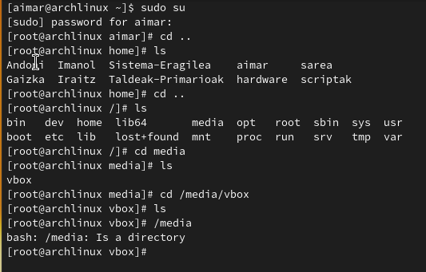
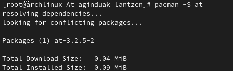
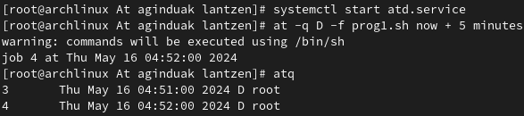
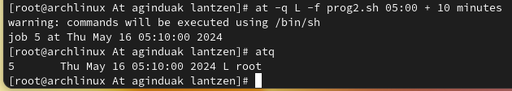
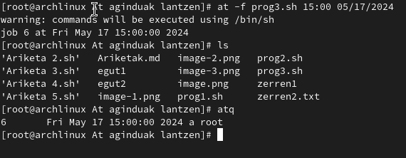
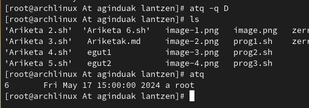

#!/bin/bash

# Ariketak

## 1 Ariketa

1- 
```bash
cal 12 2002
cal 12 2002 > egut1
```



2-
```bash
ls -lR /bin > zerren1
```


## 2 Ariketa

1-
```bash
cal 06 2004
cal 06 2004 > egut2
```


2-
```bash
ls -R > zerren2.txt
```


## 3 Ariketa

1-
```bash
cal 01 2005
cal 01 2005 > egut3
```


2- 
```bash
cd ..
ls
cd media
ls
cd /media/vbox
```


